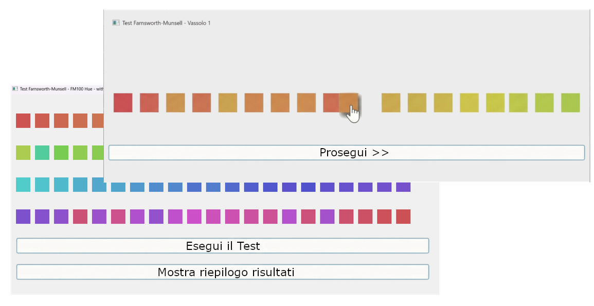
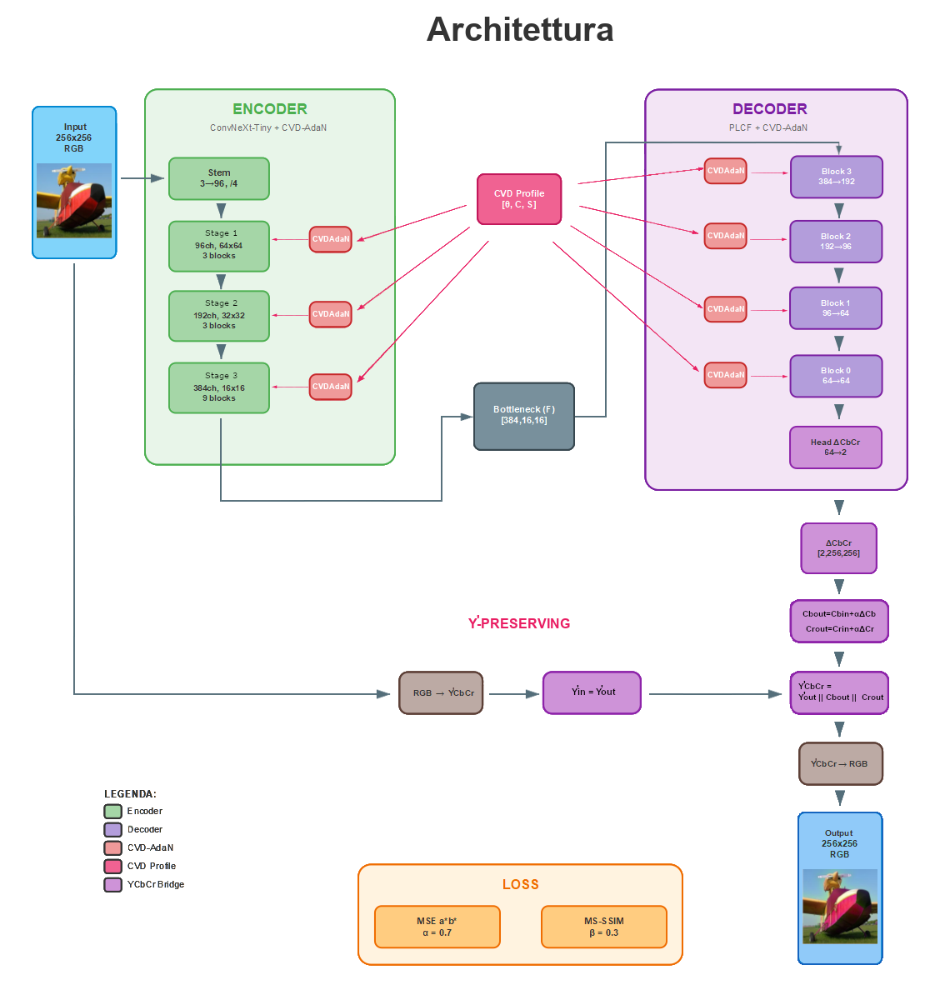
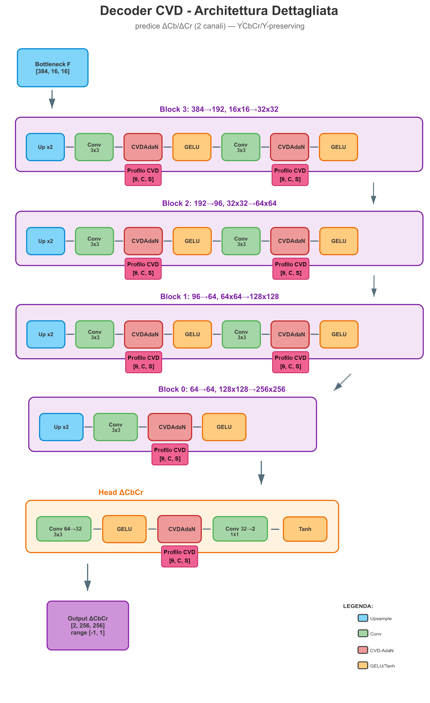

# CVD Chromatic Compensation


Sistema di compensazione cromatica in tempo reale per utenti con **deficit della visione dei colori** (CVD — Color Vision Deficiency), basato su deep learning con condizionamento adattivo (CVD-AdaIN).

> **Tesi di Laurea Magistrale in Ingegneria Informatica** — Università degli Studi di Palermo

---

## Indice

1. [Panoramica](#panoramica)
2. [Background Teorico](#background-teorico)
3. [Architettura del Modello](#architettura-del-modello)
4. [Struttura del Progetto](#struttura-del-progetto)
5. [Installazione](#installazione)
6. [Generazione Dataset](#generazione-dataset)
7. [Training](#training)
8. [Inferenza](#inferenza)
9. [Risultati](#risultati)
10. [Licenza](#licenza)

---

## Panoramica

Il progetto implementa una pipeline end-to-end per:

1. **Profilazione utente** — Test Farnsworth-Munsell 100 Hue per caratterizzare il tipo e la severità del CVD in un vettore 3D `[θ, C, S]`
2. **Generazione dataset** — Compensazione ottimale offline con l'algoritmo Teacher di Farup (variazionale anisotropo nel dominio dei gradienti)
3. **Training** — Rete neurale condizionata dal profilo CVD che apprende a replicare il Teacher in tempo reale
4. **Inferenza** — Compensazione single-image in ~45 ms su GPU (GUI Tkinter o CLI)

Il modello riceve un'immagine RGB e il profilo CVD dell'utente, e restituisce l'immagine compensata preservando la luma Y' originale (Y'-preserving in spazio YCbCr BT.601).

---

## Background Teorico

### Deficit della Visione dei Colori (CVD)

Il CVD colpisce circa l'8% della popolazione maschile e lo 0.5% di quella femminile. Si classifica in:

| Tipo | Cono affetto | Asse confusione |
|------|-------------|----------------|
| **Protanopia/Protanomalia** | L (long, rosso) | Rosso-verde |
| **Deuteranopia/Deuteranomalia** | M (medium, verde) | Rosso-verde |
| **Tritanopia/Tritanomalia** | S (short, blu) | Blu-giallo |

La severità varia da lieve (anomalia) a totale (anopia). La simulazione del CVD avviene tramite le **matrici di Machado et al. (2009)**, che modellano la riduzione di sensibilità spettrale dei coni come una trasformazione lineare nello spazio RGB parametrizzata dalla severità.

### Profilo CVD: vettore `[θ, C, S]`

Il profilo individuale viene estratto dal **Farnsworth-Munsell 100 Hue Test** tramite lo scoring quantitativo Vingrys–King-Smith e codificato come:

<p align="center">
  
</p>

- **θ (theta)** — Angolo dell'asse di confusione nel piano cromatico CIELUV $(u^*,v^*)$ (in gradi). Indica la direzione dominante del pattern di errore: consente di distinguere profili di tipo protan, deutan o tritan
- **C (Confusion index)** — Indice di confusione: misura l'ampiezza complessiva dell'errore (severità globale)
- **S (Scatter index)** — Indice di dispersione: misura la selettività e la direzionalità del pattern di errore

### Algoritmo Teacher: Farup (variazionale anisotropo)

Il gold standard per la compensazione offline utilizza l'algoritmo di Farup, che opera in **RGB lineare** nel dominio dei gradienti:
- Dal profilo CVD si ricava una base cromatica ortonormale $(e_\ell, e_d, e_c)$ in RGB lineare, dove $e_d$ è la direzione di confusione e $e_c$ la direzione di massima visibilità
- Si costruisce un campo di gradienti target $\mathbf{G} = \nabla u_0 + (\nabla u_0 \cdot e_d)\, e_c$, che reindirizza le componenti di contrasto dalla direzione "cieca" verso quella "visibile"
- Un solver variazionale anisotropo (GDIP) ricostruisce l'immagine compensata minimizzando lo scarto dal campo target, con regolarizzazione che preserva i bordi

**Limite**: il Teacher impiega secondi-minuti per immagine → non utilizzabile in tempo reale. La rete neurale viene addestrata per replicarne il risultato in millisecondi.

---

## Architettura del Modello

> Per tutte le opzioni architetturali disponibili ma non utilizzate, vedere [ARCHITECTURE_OPTIONS.md](ARCHITECTURE_OPTIONS.md).

<p align="center">
  
</p>

### `CVDCompensationModelAdaIN`

```
Image [B, 3, 256, 256]   +   CVD Profile [B, 3]
         ↓                          ↓
┌─────────────────────────────────────────────────┐
│       ENCODER (ConvNeXt-Tiny, ImageNet-1k)      │
│  CVDAdaIN in 17 punti (15 blocchi + 2 downsa.)  │
│  Stem congelato, resto fine-tuned (lr dedicato) │
└──────────────────┬──────────────────────────────┘
                   ↓
          Latent [B, 384, 16, 16]
                   ↓
┌─────────────────────────────────────────────────┐
│       DECODER PLCF (9 CVDAdaIN + tanh head)     │
│  Upsampling progressivo nearest-neighbor        │
└──────────────────┬──────────────────────────────┘
                   ↓
           ΔCbCr [B, 2, 256, 256]
                   ↓
┌─────────────────────────────────────────────────┐
│           Y'-PRESERVING OUTPUT                  │
│  Y'_out = Y'_in       (luma BT.601 copiata)    │
│  Cb_out = Cb_in + ΔCb × 0.9                    │
│  Cr_out = Cr_in + ΔCr × 0.9                    │
└─────────────────────────────────────────────────┘
```

**CVDAdaIN** (CVD Adaptive Normalization): il profilo CVD 3D viene proiettato da un Linear layer in parametri `(γ, β)` che modulano le normalizzazioni nell'encoder (17 punti, tipo LayerNorm) e nel decoder (9 punti, tipo Instance Norm). La proiezione è inizializzata near-identity (γ≈1, β≈0) così che il condizionamento emerga gradualmente durante il training. La rete si adatta dinamicamente al tipo e alla severità del deficit di ciascun utente.

<p align="center">
  
</p>

**Y'-Preserving**: il decoder produce solo 2 canali (ΔCb, ΔCr). La luma Y' (BT.601) dell'input viene copiata immutata nell'output, limitando variazioni di brightness nel dominio immagine. Nota: Y' è una grandezza operativa (luma), distinta dalla luminanza colorimetrica CIE Y e dalla lightness percettiva L*.

### Normalizzazione del profilo CVD

Il profilo `[θ, C, S]` viene normalizzato con strategia **ibrida**:
- **θ**: normalizzazione **globale** — preserva la distinzione tra tipi CVD
- **C, S**: normalizzazione **per-tipo CVD** — gestisce le distribuzioni diverse di severità per Protan/Deutan/Tritan

Le statistiche sono salvate nel checkpoint e applicate automaticamente in inferenza.

### Funzione di Loss

Loss a 2 componenti con normalizzazione statica tramite costanti di calibrazione:

$$\mathcal{L} = 0.7 \cdot \frac{\text{MSE}_{a^{*}b^{*}}}{M_{\text{mse}}} + 0.3 \cdot \frac{(1 - \text{MS-SSIM}_{\text{RGB}})}{M_{\text{ssim}}}$$

| Componente | Spazio | Peso | Descrizione |
|------------|--------|------|-------------|
| MSE a\*b\* | CIELAB | 0.7 | Errore crominanza nei canali percettivi a\*, b\* |
| MS-SSIM | sRGB | 0.3 | Preservazione della struttura multi-scala |

Le costanti $M$ vengono calibrate automaticamente sui primi ~200 campioni di training e salvate in `calibration_constants_*.json`. La ΔE2000 (CIEDE2000) viene calcolata come **metrica di validazione** ma non è inclusa nella loss.

---

## Struttura del Progetto

```
.
├── z__pipeline.py                # Menu interattivo CLI: Dataset → Training → Inference
├── z__inference_gui.py           # GUI Tkinter compensazione immagine singola
├── inference_core.py             # Modulo condiviso di inferenza
├── train.py                      # Script di training (--config <yaml>)
├── FM_TEST.py                    # Farnsworth-Munsell 100 Hue Test (PyQt5)
├── get_profile_feats.py          # Estrazione profilo CVD dal FM100
├── config_generator.py           # Generazione configurazioni YAML
│
├── CVDCompensationModelAdaIN.py  # Modello principale
├── PLCFEncoderCVD.py             # Encoder ConvNeXt-Tiny + CVD-AdaIN
├── PLCFDecoderCVD.py             # Decoder PLCF + CVD-AdaIN
├── cvd_adain_modules.py          # Moduli CVD-AdaIN
│
├── losses.py                     # CVDLoss (MSE a*b* + MS-SSIM)
├── metrics.py                    # SSIM, PSNR
├── delta_e_ciede2000_torch.py    # CIEDE2000 in PyTorch
├── color_space_utils.py          # RGB ↔ YCbCr ↔ Lab
├── cvd_dataset_loader.py         # PyTorch Dataset
├── cvd_simulator.py              # Simulazione CVD (Machado 2009)
├── cvd_shared_cache.py           # Cache matrici Machado
├── cvd_cache_optimizer.py        # Cache profili JSON
├── cvd_constants.py              # Costanti condivise
├── teacher_farup_full.py         # Algoritmo Teacher (CPU)
├── teacher_farup_gpu.py          # Algoritmo Teacher (GPU)
├── mapping_x_to_T.py             # Mapping clinico (θ,C,S) → tipo CVD
├── train_utility.py              # Utilità di training
├── simple_logger.py              # Logger CSV + plot
├── precision_utils.py            # Rilevamento precisione CUDA
│
├── configs/                      # Configurazioni YAML
├── CVD_dataset_generator/        # Pipeline generazione dataset
├── results/                      # Best checkpoint + calibrazione (Git LFS)
├── variational-anisotropic-gradient-domain-main/
│                                 # Dipendenza esterna (GPL v3) per Teacher Farup
├── ARCHITECTURE_OPTIONS.md       # Opzioni architetturali disponibili (documentazione)
├── requirements.txt
└── README.md
```

---

## Installazione

### Prerequisiti

- Python 3.10+
- CUDA 12.x con GPU NVIDIA
- ~200 MB di spazio disco per il checkpoint (via Git LFS)

### Setup

```bash
# 1. Creare ambiente conda
conda create -n cvd python=3.11 -y
conda activate cvd

# 2. Installare PyTorch con CUDA 12.8
pip install torch torchvision --index-url https://download.pytorch.org/whl/cu128

# 3. Installare dipendenze
pip install -r requirements.txt
```

### Dipendenze principali

| Pacchetto | Versione di rif. | Uso |
|-----------|-----------------|-----|
| `torch` | 2.7.0+cu128 | Framework deep learning |
| `torchvision` | 0.22.0+cu128 | Backbone ConvNeXt-Tiny pretrained |
| `timm` | 1.0.19 | Model registry |
| `numpy` | 2.3.2 | Array numerici |
| `colour-science` | 0.4+ | Matrici Machado 2009 |
| `pytorch-msssim` | 1.0+ | MS-SSIM nella loss |
| `torchmetrics` | 1.0+ | SSIM / PSNR |
| `scipy` | 1.16.1 | Solver variazionale (solo dataset generation) |
| `matplotlib` | 3.9.1 | Plot |
| `PyQt5` | 5.15+ | _Opzionale_ — GUI FM100 Test |

---

## Generazione Dataset

Il dataset è generato compensando immagini di **Places365** con il Teacher Farup per profili CVD simulati.

```bash
python z__pipeline.py --dataset
```

Per ogni immagine sorgente e profilo CVD generato casualmente:
1. Simula il CVD sull'immagine (Machado 2009)
2. Applica l'algoritmo variazionale di Farup per la compensazione ottimale
3. Salva la coppia (originale, compensata) con metadati del profilo CVD in JSON

Dataset risultante: **94.321 immagini** di training, **20.048** di validazione.

> **Nota:** Il dataset pre-generato non è incluso nel repository perché supera i 10 GB.
> Per richiedere il dataset, aprire una [Issue](https://github.com/googlielmo93/cvdadan-personalized-color-compensation/issues) su questo repository.

---

## Training

### Hardware

| | Specifica |
|--|-----------|
| **GPU** | NVIDIA GeForce RTX 3090 (24 GB VRAM) |
| **Precisione** | bfloat16 (mixed precision) |

### Avvio

```bash
# Menu interattivo
python z__pipeline.py --training

# Diretto
python train.py --config "configs/grid_cvd_20251212_215310/config_01_no_delta_e.yaml"
```

Il training usa: auto-resume da checkpoint, early stopping (patience 20 su Val ΔE00, con soglia ΔE00 < 5.0 e quality gates su SSIM/PSNR), ReduceLROnPlateau (factor 0.7, patience 15, min_lr 5×10⁻⁶), calibrazione automatica delle costanti di loss sui primi ~200 campioni.

### Risultati

| Metrica | Valore |
|---------|--------|
| **Epoche totali** | 187 (early stopping) |
| **Epoca migliore** | 185 |
| **Val ΔE00** | **1.27** (CIEDE2000) |
| **Val SSIM** | **0.989** |
| **Val PSNR** | **~37.2 dB** |

Il checkpoint (epoch 185, 173.1 MB) è incluso nel repository via Git LFS.

---

## Inferenza

### GUI (raccomandato)

```bash
python z__inference_gui.py
```

Interfaccia Tkinter a 4 tab:
1. **Profilo CVD** — Inserimento manuale di θ, C, S oppure caricamento JSON da FM_TEST.py
2. **Immagine** — Selezione immagine
3. **Compensazione** — Selezione checkpoint ed elaborazione
4. **Risultato** — Confronto side-by-side con salvataggio

### CLI

```bash
python z__pipeline.py --inference
```

### Profilazione utente

Per ottenere il profilo CVD di un utente reale:

```bash
python FM_TEST.py
```

Richiede PyQt5. Produce un file JSON con `[θ, C, S]` utilizzabile direttamente nella GUI di inferenza.

---

## Risultati

Il modello raggiunge una **ΔE00 media di 1.27** sulla validazione (soglia di percettibilità umana ≈ 1.0), con SSIM di 0.989 e PSNR di ~37.2 dB.

La compensazione preserva **la luma Y'** (BT.601, copiata identica dall'input) e modifica solo la crominanza (Cb, Cr), limitando variazioni di brightness nel dominio immagine.

---

## Licenza

La cartella `variational-anisotropic-gradient-domain-main/` è distribuita sotto licenza **GPL v3** (vedi relativo LICENSE). Necessaria solo per la generazione del dataset (Teacher Farup), non per l'inferenza.
